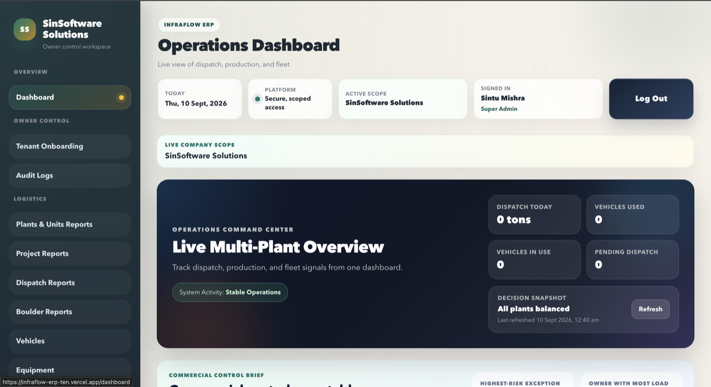
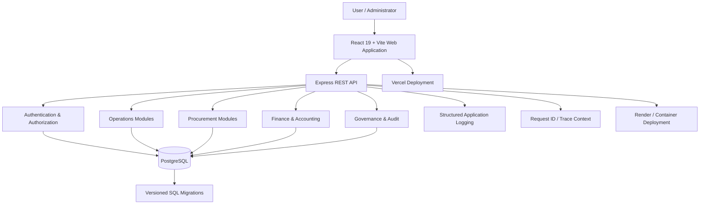
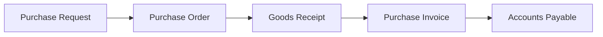
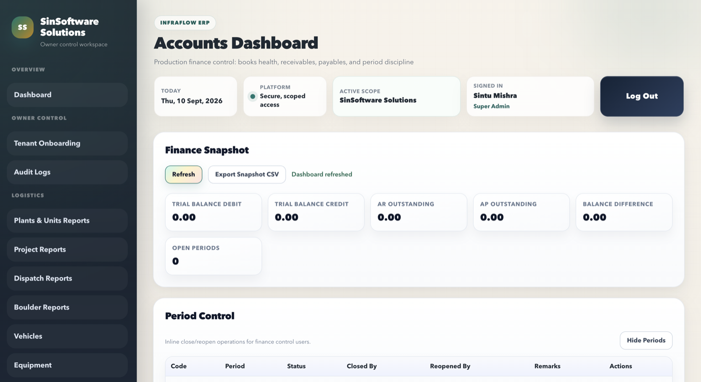
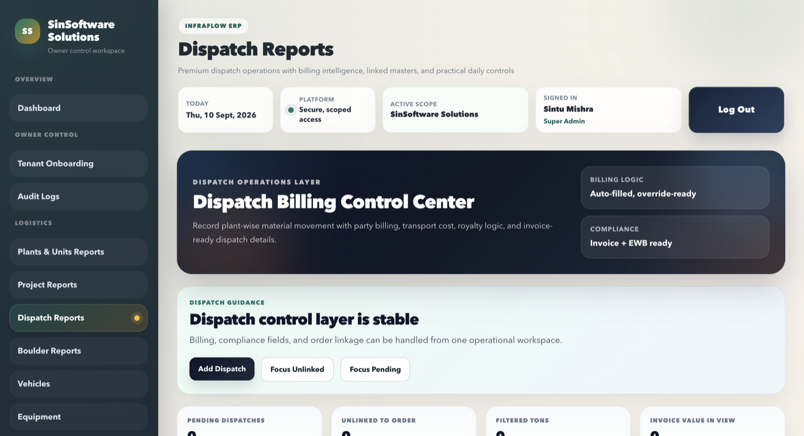
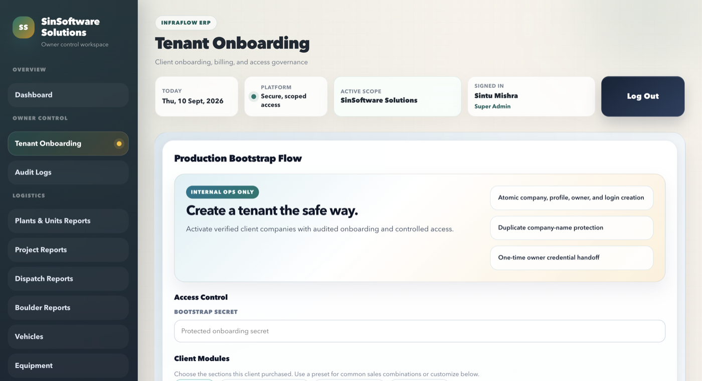
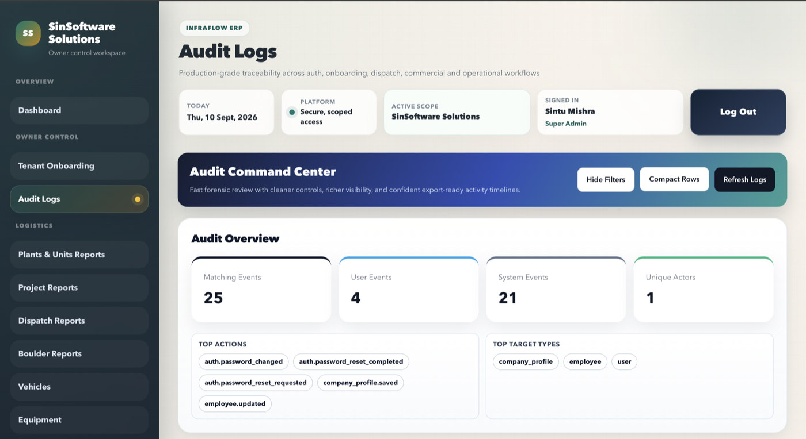

<div align="center">

# InfraFlow ERP

### Construction Operations, Procurement & Financial Management Platform

A production-oriented full-stack ERP designed to connect construction operations, commercial workflows, procurement, finance, reporting, governance, and multi-company data management in one system.

[](https://github.com/SintuMishra/infraflow-erp/actions/workflows/ci.yml)
[](https://react.dev/)
[](https://nodejs.org/)
[](https://www.postgresql.org/)
[](https://www.docker.com/)
[](https://vite.dev/)
[](https://jwt.io/)

**React · Node.js · Express · PostgreSQL · REST API · JWT · RBAC · Docker**

[Live Application](https://infraflow-erp-ten.vercel.app) ·
[Source Code](https://github.com/SintuMishra/infraflow-erp) ·
[Portfolio](https://portfolio-flame-six-93wdoxmah1.vercel.app/)

</div>

---

## Overview

**InfraFlow ERP** is a full-stack enterprise resource planning platform built around the operational and financial workflows of construction-oriented businesses.

Instead of treating the application as a collection of independent CRUD screens, the system connects business entities and workflows across:

- company administration
- master data
- parties and vendors
- projects and plants
- dispatch operations
- commercial rates
- procurement
- goods receipts
- purchase invoices
- accounting
- financial controls
- reporting
- auditability
- user access and governance

The project focuses on the engineering concerns behind business software: **data isolation, authorization, transactional workflows, database evolution, validation, auditability, deployment, testing, and operational readiness**.

### Product Preview

The operations dashboard provides a unified view of plant activity, operational status, business metrics, and company-scoped ERP workflows.



---

## Architecture



### Application Layers

```text
┌─────────────────────────────────────────────────────────────┐
│                         Client                              │
│                   React 19 + Vite                           │
│       Routing · Authentication · Role-aware UI              │
└────────────────────────────┬────────────────────────────────┘
                             │
                             │ REST / JSON
                             ▼
┌─────────────────────────────────────────────────────────────┐
│                       API Layer                             │
│                    Node.js + Express                        │
│                                                             │
│  Middleware · Validation · Controllers · Services · Models  │
└────────────────────────────┬────────────────────────────────┘
                             │
              ┌──────────────┼──────────────┐
              ▼              ▼              ▼
       Operations       Procurement      Finance
              │              │              │
              └──────────────┼──────────────┘
                             ▼
┌─────────────────────────────────────────────────────────────┐
│                       PostgreSQL                            │
│                                                             │
│ Multi-company scope · Constraints · Migrations · Indexes    │
└─────────────────────────────────────────────────────────────┘
```

---

# Core Business Capabilities

## Operations

Operational modules provide the business foundation used by the rest of the platform.

Key areas include:

- company profile
- operational masters
- parties
- vendors
- employees
- vehicles
- plants
- projects
- transport rates
- party material rates
- party orders
- dispatch
- crusher reporting
- project reporting
- operational dashboards

These modules form the master and transactional data used throughout procurement and financial workflows.

---

## Procurement

InfraFlow includes a structured procurement workflow rather than only standalone purchase records.



Implemented areas include:

- purchase requests
- custom requested items
- vendor selection
- supplier quotation-oriented workflows
- purchase orders
- goods receipts
- purchase invoices
- vendor integration
- item categories
- material/unit handling
- procurement validation
- procurement integration testing

---

## Finance & Accounting

The finance layer is designed around controlled accounting workflows.

Major areas include:

- chart/account masters
- general ledger
- journal vouchers
- accounts receivable
- accounts payable
- cash and bank transactions
- financial reports
- posting rules
- accounting policy controls
- accounting period controls
- transaction history
- controlled financial operations

Finance-specific testing also covers concurrency and policy behavior.

### Financial Control Workspace

The accounting workspace brings ledger activity, receivables, payables, trial-balance visibility, and accounting-period controls into a unified finance interface.



---

## Commercial & Dispatch Workflows

Construction-specific commercial operations include:

- party material rates
- transport rates
- effective-dated rates
- loading-basis configuration
- unit-aware pricing
- royalty-related dispatch data
- dispatch reports
- party orders
- vehicle-linked operations
- material conversion support

The database migration history preserves the evolution of these workflows rather than relying on ad-hoc database changes.

### Dispatch Control Center

Operational reporting connects dispatch activity with plant, project, vehicle, party, material, and commercial data.



---

# Multi-Company Data Architecture

InfraFlow includes **company-scoped data isolation** throughout the backend.

Authenticated sessions are associated with company context and company-aware services use that context when accessing business data.

The backend also performs startup verification for the company-scope database foundation when enforcement is enabled.

```text
Authenticated User
       │
       ▼
JWT Session
       │
       ├── User
       ├── Role
       └── Company
             │
             ▼
      Company-scoped API
             │
             ▼
      PostgreSQL queries
             │
             ▼
        Tenant data
```

This architecture reduces the risk of accidental cross-company access in a multi-company ERP environment.

### Tenant Onboarding

Administrative onboarding supports controlled company provisioning and company-scoped platform access.



---

# Authentication & Authorization

Authentication is implemented using:

- JSON Web Tokens
- password hashing with bcrypt
- protected API routes
- company-context validation
- normalized application roles
- role authorization middleware
- module-level access controls
- protected frontend routes

Example authorization flow:

```text
Request
   │
   ▼
JWT Authentication
   │
   ▼
Company Context Validation
   │
   ▼
Role / Module Authorization
   │
   ▼
Controller
   │
   ▼
Business Service
```

The application also includes rate-limiting and authentication-related test coverage.

---

### Governance & Auditability

Administrative activity is surfaced through an audit workspace that supports operational traceability across platform actions.



---

# Security Engineering

Security-related controls include:

- `helmet` HTTP security middleware
- configurable CORS policy
- JWT authentication
- bcrypt password hashing
- role-based access control
- company-scope validation
- authentication rate limiting
- environment-based secrets
- production secret-strength validation
- protected password-reset behavior
- structured error responses
- request identifiers
- audit-oriented workflows

Production configuration rejects weak or placeholder JWT secrets.

Secrets are supplied through environment variables and are not committed to the repository.

---

# Database Engineering

InfraFlow uses **PostgreSQL** with a versioned SQL migration workflow.

The migration history covers the progressive development of:

```text
Legacy schema compatibility
        ↓
Multi-company foundation
        ↓
Authentication security
        ↓
Commercial operations
        ↓
Reporting
        ↓
Finance & accounting
        ↓
Finance governance
        ↓
Session/rate-limit hardening
        ↓
Procurement
        ↓
Unit-aware rate handling
        ↓
Equipment operations
        ↓
Performance indexes
```

Database tooling includes:

- ordered migrations
- selected rollback scripts
- migration runner
- migration tests
- legacy-schema compatibility migrations
- administrative audit SQL
- safe data synchronization utilities
- master-data verification scripts
- performance-oriented indexes

---

# Backend Engineering

The backend follows a modular structure.

```text
backend/src/
├── common/
├── config/
├── database/
├── middlewares/
├── modules/
├── routes/
├── scripts/
└── utils/
```

Most business modules are organized around:

```text
module/
├── controller
├── model
├── routes
├── service
├── validation
└── index
```

This separates HTTP handling, business logic, persistence, routing and validation responsibilities.

---

# API Platform

The backend is built with **Express 5**.

Platform-level behavior includes:

- RESTful routing
- centralized API mounting
- environment validation
- PostgreSQL connection management
- request IDs
- structured HTTP logging
- centralized error handling
- graceful shutdown
- SIGINT/SIGTERM handling
- unhandled rejection handling
- uncaught exception handling
- configurable proxy trust
- production-aware CORS

Every request receives an `X-Request-Id`, allowing request-specific failures to be correlated with application logs.

---

# Frontend

The administration interface uses:

- React 19
- Vite
- React Router
- Axios
- ESLint
- reusable layout components
- authentication context
- protected/public routing
- role-aware navigation
- API service abstraction
- frontend caching utilities
- reusable hooks

Representative screens include:

```text
Dashboard
Company Profile
Employees
Parties
Vendors
Vehicles
Plants
Masters
Dispatch
Project Reports
Crusher Reports
Purchase Requests
Purchase Orders
Goods Receipts
Purchase Invoices
Chart of Accounts
Journal / Voucher Entry
General Ledger
Receivables
Payables
Cash & Bank
Financial Reports
Finance Policies
Accounting Period Controls
Audit Logs
Tenant Onboarding
```

---

# Testing Strategy

InfraFlow has a substantial backend test suite covering multiple levels of the application.

### Authentication & Security

- authentication models
- authentication services
- route access
- auth/role middleware
- rate limiting
- environment validation

### Company & Governance

- company scoping
- onboarding
- owner governance
- audit-log models and services
- master-data access controls

### Finance

- finance engine
- finance validations
- finance route access
- finance master governance
- finance policy controls
- accounts receivable
- finance concurrency integration testing

### Procurement

- purchase route access
- purchase invoice services
- procurement access rules
- procurement integration flow

### Operations

- dashboard
- dispatch
- employees
- projects
- transport rates
- material rates
- masters
- date handling
- API routes

### Database

- migration runner
- schema compatibility
- configuration seed behavior

Run the standard backend test suite with:

```bash
cd backend
npm test
```

---

# Finance Concurrency Verification

A dedicated PostgreSQL test environment is available for finance concurrency testing.

```bash
cd backend

npm run db:finance:concurrency:up
npm run db:finance:concurrency:wait
npm run migrate:finance:concurrency
npm run test:finance:concurrency
```

The test database can be reset with:

```bash
npm run db:finance:concurrency:reset
```

---

# Load Testing

The repository includes **k6** load-test scenarios under:

```text
tests/load/
├── k6-erp-core.js
├── k6-login.js
└── README.md
```

These scenarios support performance validation of important ERP and authentication workflows.

---

# Verification Pipeline

Backend verification:

```bash
cd backend

npm install
npm run verify:practical
```

This combines application verification, tests, finance policy checks and local go-live configuration checks.

Frontend verification:

```bash
cd web_admin

npm install
npm run verify:local
```

This runs:

```text
ESLint
  ↓
Production Build
```

A repository-level pre-live script is also available:

```bash
./scripts/final-prelive-check.sh
```

---

# Technology Stack

| Layer | Technology |
|---|---|
| Frontend | React 19 |
| Frontend tooling | Vite |
| Routing | React Router |
| HTTP client | Axios |
| Backend | Node.js |
| API framework | Express 5 |
| Database | PostgreSQL |
| Authentication | JWT |
| Password hashing | bcrypt |
| Security headers | Helmet |
| Logging | Morgan + application logger |
| Containers | Docker |
| Container orchestration | Docker Compose |
| Backend deployment | Render-compatible configuration |
| Frontend deployment | Vercel-compatible configuration |
| Reverse proxy deployment | Caddy example |
| Load testing | k6 |
| Testing | Node.js test runner |

---

# Repository Structure

```text
infraflow-erp/
│
├── backend/
│   ├── db/
│   │   ├── admin/
│   │   ├── migrations/
│   │   └── rollbacks/
│   │
│   ├── src/
│   │   ├── common/
│   │   ├── config/
│   │   ├── database/
│   │   ├── middlewares/
│   │   ├── modules/
│   │   ├── routes/
│   │   ├── scripts/
│   │   └── utils/
│   │
│   ├── tests/
│   ├── Dockerfile
│   └── package.json
│
├── web_admin/
│   ├── public/
│   ├── src/
│   │   ├── app/
│   │   ├── components/
│   │   ├── context/
│   │   ├── features/
│   │   ├── hooks/
│   │   ├── pages/
│   │   ├── services/
│   │   ├── styles/
│   │   └── utils/
│   │
│   ├── Dockerfile
│   ├── vercel.json
│   └── package.json
│
├── tests/
│   └── load/
│
├── deploy/
│   └── Caddyfile.oracle.example
│
├── docs/
│
├── scripts/
│   ├── backup-db.sh
│   ├── backup-offsite.sh
│   ├── deploy.sh
│   ├── final-prelive-check.sh
│   └── restore-db.sh
│
├── docker-compose.yml
├── docker-compose.prod.yml
├── render.yaml
└── README.md
```

---

# Local Development

## Prerequisites

Install:

- Node.js
- npm
- PostgreSQL

Docker is recommended for containerized workflows.

---

## Clone the Repository

```bash
git clone https://github.com/SintuMishra/infraflow-erp.git
cd infraflow-erp
```

---

## Backend Setup

```bash
cd backend

cp .env.example .env
npm install
npm run migrate
npm run dev
```

Configure the values described in `.env.example`, including:

```text
PORT
NODE_ENV
JWT_SECRET
DB_HOST
DB_PORT
DB_NAME
DB_USER
DB_PASSWORD
```

Do not commit `.env`.

---

## Frontend Setup

Open another terminal:

```bash
cd web_admin

cp .env.example .env
npm install
npm run dev
```

Configure:

```text
VITE_API_BASE_URL
```

The frontend communicates with the backend through the configured REST API base URL.

---

# Docker

The repository includes container definitions for both frontend and backend.

For the development/container stack:

```bash
docker compose up --build
```

Production-oriented container configuration is available through:

```text
docker-compose.prod.yml
```

The repository also contains a dedicated finance test database Compose configuration.

---

# Deployment

The project includes multiple deployment paths.

### Frontend

The React application includes Vercel SPA rewrite configuration.

```text
web_admin/vercel.json
```

### Backend

`render.yaml` defines:

- Node.js backend service
- PostgreSQL database
- migration-before-start workflow
- health check
- production environment configuration
- generated secrets
- database variable wiring

### Self-hosted / VM

The project also includes:

```text
docker-compose.prod.yml
deploy/Caddyfile.oracle.example
scripts/deploy.sh
```

These support container-oriented deployment on a Linux host.

---

# Backup & Recovery

Operational scripts include:

```text
scripts/backup-db.sh
scripts/backup-offsite.sh
scripts/restore-db.sh
```

Backup and recovery procedures are also documented in the project documentation.

---

# Documentation

InfraFlow includes engineering, deployment and operational documentation under `docs/`.

Important starting points include:

- `docs/HANDOVER-DOCUMENTATION-INDEX.md`
- `docs/system-architecture-module-guide.md`
- `docs/developer-guide-professional.md`
- `docs/DEPLOYMENT-RUNBOOK.md`
- `docs/finance-accounts-guide.md`
- `docs/role-permission-guide.md`
- `docs/COMPLETE-END-TO-END-TESTING-REPORT-2026-04-22.md`
- `docs/PROCUREMENT-UAT-GO-LIVE-CHECKLIST-2026-04-22.md`
- `docs/GO-LIVE-MASTER-CHECKLIST.md`
- `docs/faq-troubleshooting-reference.md`

The documentation covers architecture, development, deployment, finance, procurement, access control, testing, operations and handover procedures.

---

# Operational Engineering

The repository contains tooling beyond normal application source code.

Examples include:

- database backup
- off-site backup
- database restoration
- deployment scripting
- go-live verification
- smoke-test flows
- migration execution
- company bootstrap
- trial baseline reset
- data cleanup
- operational snapshot export
- finance concurrency verification
- load testing

The goal is to treat deployment and operational reliability as part of the application rather than as separate manual work.

---

# Engineering Decisions

InfraFlow was developed around several principles.

### Data isolation

Business data is scoped by company context rather than relying only on frontend filtering.

### Database evolution

Schema changes are represented as ordered migrations instead of manual production modifications.

### Authorization at the backend

Sensitive operations are protected by server-side authentication and role/module authorization.

### Financial integrity

Finance operations use additional governance, policy and concurrency validation rather than treating accounting records as ordinary CRUD entities.

### Operational verification

Testing, smoke workflows, deployment checks and migration validation are maintained alongside application code.

### Documentation

Architecture, operations, deployment, troubleshooting and handover documentation are maintained within the repository.

---

# Current Engineering Improvements

Areas planned for continued improvement include:

- centralized observability
- longer-duration production-like load testing
- deeper deployment automation
- additional frontend automated testing
- further RBAC administration refinement
- CI/CD automation
- expanded operational monitoring

---

# Project Status

InfraFlow currently includes functional implementations across:

```text
Operations        ✓
Commercial Data   ✓
Dispatch          ✓
Procurement       ✓
Finance           ✓
Accounting        ✓
Company Scoping   ✓
Authentication    ✓
RBAC              ✓
Auditability      ✓
Migrations        ✓
Backend Tests     ✓
Docker Packaging  ✓
Deployment Config ✓
Load-Test Tooling ✓
Documentation     ✓
```

Development continues around automation, observability, testing depth and production operations.

---

# Author

## Sintu Mishra

**Software Engineer · Backend · Systems · Robotics**

I build software across backend engineering, Linux systems, automation, data infrastructure and full-stack applications.

[Portfolio](https://portfolio-flame-six-93wdoxmah1.vercel.app/) ·
[GitHub](https://github.com/SintuMishra) ·
[LinkedIn](https://www.linkedin.com/in/sintu-mishra-3o11/) ·
[Email](mailto:sintumishra22201@gmail.com)

---

<div align="center">

### InfraFlow ERP

**Construction Operations · Procurement · Finance · Engineering**

Built as an engineering-focused full-stack ERP project.

</div>
